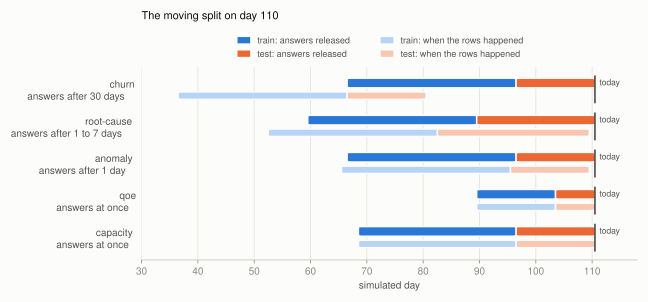
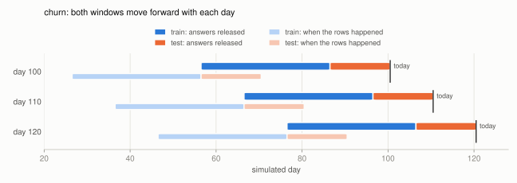
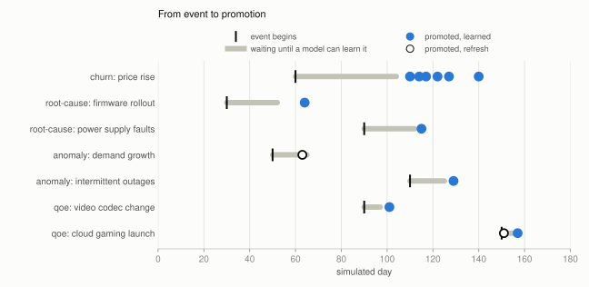
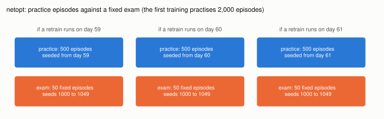

# The moving split

**All data and environments here are simulated.**

Every simulated day, each use case splits its data into a training set and a test set, and
the split moves forward one day with the calendar. This page shows how that split works for
each use case, why promotions come some time after the events that cause them, and how
network optimization differs. The figures and every number on this page are computed from
the code (`docs/figures/moving_split.py`), and `docs/figures/test_moving_split.py` holds the
numbers.

## One rule, keyed on when answers arrive

On day `d`, a use case looks back from today in two adjacent windows that never overlap. Both
count days by when an answer (a label) became known, not by when the data happened:

- **test window**: answers that arrived in the last `E` days, ending today;
- **train window**: the `T` days of answers just before that.

Each day the live model is scored on the test window. When a retrain is triggered, a
candidate is trained on the train window, and the live model, the candidate and the baseline
are all scored on the same test window. The candidate is promoted only if it wins by the use
case's margin. Tomorrow both windows move forward one day. Nothing is shuffled: training
always comes before testing in time.

<picture>
  <source media="(prefers-color-scheme: dark)" srcset="figures/split-day-110-dark.svg">
  
</picture>

The upper bar of each use case is the window of answers; the lower, lighter bar is when the
rows behind those answers were generated. The gap between them is the wait for an answer:
churn trains on customers from 44 to 73 days ago, while QoE's rows are the answers.

| Use case | Answer arrives after | Train window `T` | Test window `E` | Test rows generated on day `d` | Train rows generated on day `d` |
|---|---|---|---|---|---|
| churn | 30 days | 30 days | 14 days | d-43 to d-30 | d-73 to d-44 |
| root cause | 1 to 7 days, per ticket | 30 days | 21 days | d-27 to d-1 | d-57 to d-22 |
| anomaly | 1 day | 30 days | 14 days | d-14 to d-1, audit sample only | d-44 to d-15, checked hours only |
| QoE | at once | 14 days | 7 days | d-6 to d | d-20 to d-7 |
| capacity | at once | 28 days | 14 days | d-13 to d | d-41 to d-14 |

Capacity's rows also carry traffic from 7 to 14 days before each row: a forecast made 7 days
ahead may only use what was known then.

## The split moves with the calendar

<picture>
  <source media="(prefers-color-scheme: dark)" srcset="figures/split-slide-churn-dark.svg">
  
</picture>

The same two windows on three days, ten days apart: they keep their size and move together.
Every day's decision is made on that day's pair.

## Why promotions come after events

A candidate can only learn a change once rows from after the change are in its train window.
That takes about the event day plus the answer delay plus the test window. A promotion
before then cannot have learned the event; the results summary calls it a **refresh**, a win
on more recent data, and checks every promotion's training rows to tell the two apart.

<picture>
  <source media="(prefers-color-scheme: dark)" srcset="figures/events-to-promotions-dark.svg">
  
</picture>

| Use case | Event | Began | First day a model can learn it | Promoted |
|---|---|---|---|---|
| churn | price rise | 60 | 104 | 110, 114, 117, 122, 127, 140 (all learned) |
| root cause | firmware rollout | 30 | 52 | 64 (learned) |
| root cause | power supply faults | 90 | 112 | 115 (learned) |
| anomaly | demand growth | 50 | 65 | 63 (refresh) |
| anomaly | intermittent outages | 110 | 125 | 129 (learned) |
| QoE | video codec change | 90 | 97 | 101 (learned) |
| QoE | cloud gaming launch | 150 | 157 | 151 (refresh), 157 (learned) |

The test window is also the delay before a model can react: a longer window compares models
more steadily and reacts later. Capacity and network optimization have no row here: capacity
promoted nothing (its forecaster tracks growth through its lags, and the gate refused models
retrained on the holiday week), and network optimization's events did not trigger a retrain.

## Network optimization: practice and exam, not past and future

Network optimization has no answers to wait for: a policy is judged by playing. Its split is
not by time but by episode. A retrain practises in that day's version of the simulator, on
episodes seeded from the day; every policy (live, candidate and the rule-based baseline) is
then scored on the same 50 fixed exam episodes, so none is luckier than another.

<picture>
  <source media="(prefers-color-scheme: dark)" srcset="figures/netopt-practice-and-exam-dark.svg">
  
</picture>

The first training practises 2,000 episodes; a retrain continues from the live policy for 500.

## Redrawing the figures

```bash
uv run python docs/figures/moving_split.py
uv run pytest -q docs
```

The script reads the use cases' settings, runs the same window function the loop uses, and
takes promotion days from `results/calendar-2026-01-01-180-days.md`. The tests check the
numbers above, not the images.
